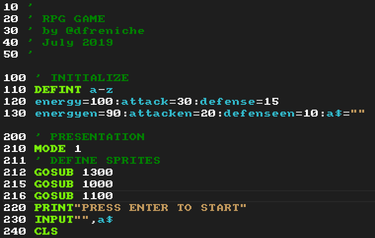

# ZX81 - Basic README

ZX81 BASIC syntax highlighting for Visual Studio Code.

Supports all reserved words from the ZX81 BASIC range.


Best results when also using a [CPC font](https://fonts2u.com/download/amstrad-cpc464-regular.font) ;-)



## Basic

### Statements

```text
AT,CLEAR,CLS,CONT,COPY,DIM,FAST,FOR,GOSUB,GOTO,IF,INPUT,
LET,LIST,LLIST,LOAD,LPRINT,NEW,NEXT,PAUSE,PLOT,POKE,PRINT,
RAND,REM,RETURN,RUN,SAVE,SCROLL,SLOW,STEP,STOP,TAB,THEN,TO,
UNPLOT
```

### Functions

```text
ABS,ACS,ASN,ATN,CHR,CODE,COS,EXP,INKEY,INT,LEN,LN,
PEEK,PI,RND,SGN,SIN,SQR,STR,TAN,TLS,USR,VAL
```

### Operators

```text
AND,NOT,OR
```

## Installation

Launch VS Code Quick Open (**Ctrl+P**), paste the following commnand, and press Enter.

```vscode
ext install zx81basic
```

## Theme colors

To change the colors to your liking, just edit `settings.json` global file and add:

```
"editor.tokenColorCustomizations": {
        "textMateRules": [
                {
                    "scope": [
                    "keyword.control.amstradbasic"
                    ],
                    "settings": {
                        "foreground": "#79f109",
                        "fontStyle": "bold"
                    }
                },
                {
                    "scope": [
                        "entity.name.function.amstradbasic",
                    ],
                    "settings": {
                        "foreground": "#e98707"
                    }
                },
                {
                    "scope": [
                    "comment.line.amstradbasic",
                    ],
                    "settings": {
                        "foreground": "#008000",
                    }
                },
                {
                    "scope": [
                        "keyword.operator.logical.amstradbasic"
                    ],
                    "settings":{
                        "foreground": "#8E8E8E",
                    }
                },
                
                
                {
                    "scope": [
                        "variable.name.amstradbasic"
                    ],
                    "settings": {
                        "foreground": "#32bacc"
                    }
                },
                {
                    "scope": [
                        "constant.numeric.amstradbasic"
                    ],
                    "settings": {
                        "foreground": "#ffffff"
                    }
                },
                {
                    "scope": [
                        "string"
                    ],
                    "settings": {
                        "foreground": "#c2995c"
                    }
                }
                
        ]
    }
```


## Acknowledgments

- This is just a port of the awesome [ZX-Basic](https://github.com/jsanjose/zxbasic-vscode) extension
- The image [`Locomotive_BASIC_amstrad_cpc`](https://en.wikipedia.org/wiki/Locomotive_BASIC#/media/File:Locomotive_BASIC_amstrad_cpc.PNG) was taken from Wikipedia and is released under Public Domain License
